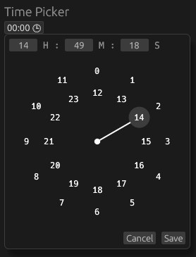

# Egui Timepicker widget

This is a simple timepicker widget for the [egui](https://github.com/emilk/egui) library.

## Usage

```rust
use egui_timepicker::TimePicker;

let mut time = chrono::Local::now().time();
egui::CentralPanel::default().show(ctx, |ui| {
    TimePicker::new(&mut time).ui(ui);
});
```

## Screenshots




